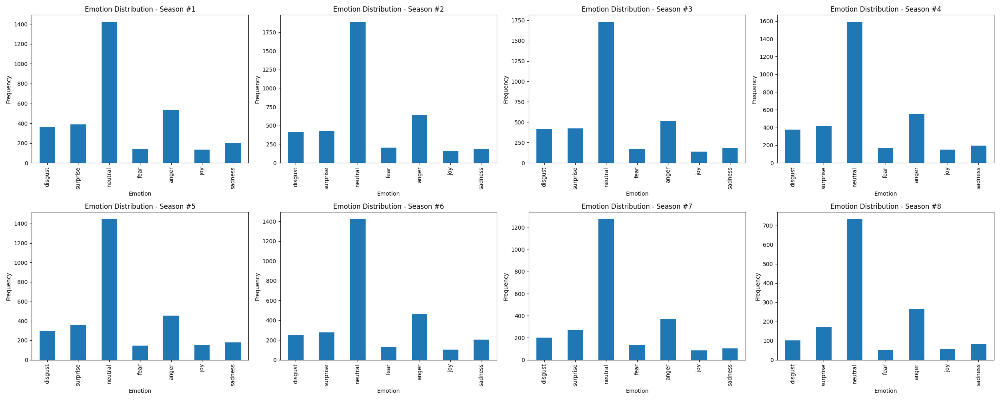
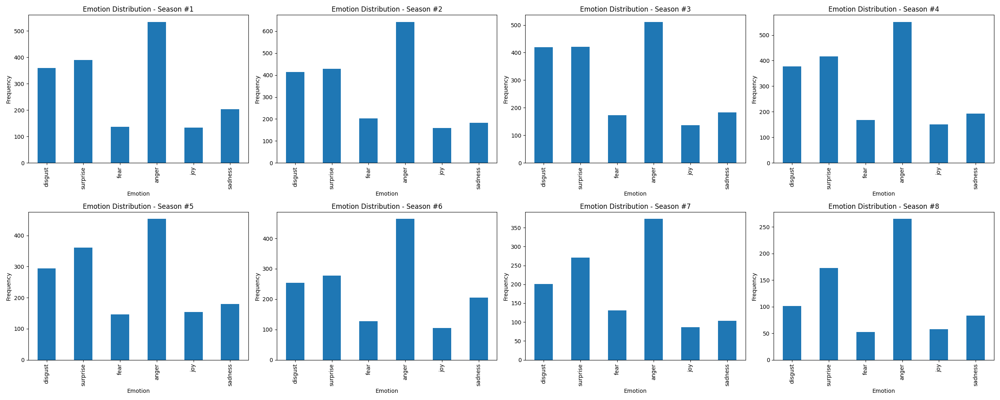
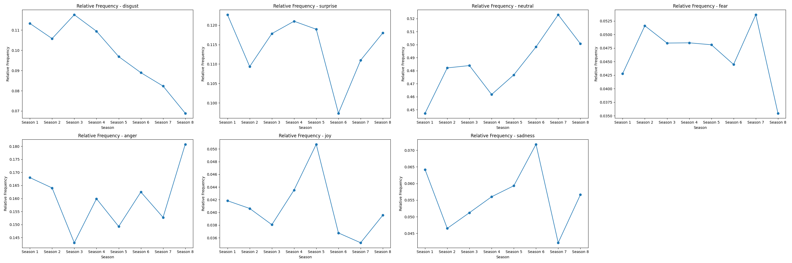

# CDS Language Analytics: Assignment #4 - Emotion analysis using pretrained models

## Description
This repository aims to use a pretrained emotion classifier to process a text dataset (the Game of Thrones script), and extract emotion labels for each line spoken in the show. This will then be plotted afterwards, showing the emotional distribution across the shows seasons.

***This code uses CodeCarbon to monitor the environmental effects of running this code. The effects of which can be found in the `out/emissions` folder***

## Setup

1. Make sure to have python and Git Bash installed!

2. Open a Git Bash terminal and use Git to download the repository:
```sh
git  clone  https://github.com/missingusername/cds-lang-git.git
```
3. Navigate to the project folder for this assignment:
```sh
cd  cds-lang-git/assignment2
```
4. Before running the program, you first have to set up a virtual environment with the required dependencies. This can be done by simply running either  `bash win_setup.sh`  or  `bash unix_setup.sh`  depending on your system.

5. Before we can run the script, we first need the Game of Thrones script in `.csv` form. The dataset can be found [here](https://www.kaggle.com/datasets/albenft/game-of-thrones-script-all-seasons?select=Game_of_Thrones_Script.csv), where you can download the `archive.zip` file. When downloaded, unzip the folder and place `Game_of_Thrones_Script.csv` in the `/in` folder of the `assignment4` directory.

6. The `plot.py` script uses Argparse to parse commands to the script from the command line.

| Name | Flag | Description | Is required? |
|--|--|--|--|
| exclude | -e | Emotion labels to exclude while plotting the emotion label distribution. For example, to exclude disgust & neutral, you would use `-e disgust neutral`. | OPTIONAL |

To run the program, you can run the OS-appropriate run script. Here's an example of how to run the script with arguments:
Run basic unix script:
```sh
bash unix_run.sh
```

Example of running windows script, using command line arguments to exclude `neutral` & `fear` label.
```sh
bash win_run.sh -e neutral fear
```

## Takeaways from output
To examine the output of the code, we can utilize the plots generated in the `plot.py` script:

**Emotion distribution across seasons:**



From these bar charts we can see that throughout every season, `neutral` is by far the most common emotion. This would make sense, in that it is essentially the lack of any of the other distinct emotions. This would be any regular sentence where someone is neither overjoyed, angry, sad, etc., just regular indifference.

While we can still see how often the other emotions appear, the `neutral` bar does skew the scales quite a bit. Here, we can plot the motions again, excluding the `neutral` label.



This lets us get a much clearer picture of the emotional distribution throughout the seasons. we can see that `anger` is now consistently the most prevailing emotion. We can also see that throughout most of the early seasons, `disgust` and `surprise` are somewhat tied, with a gap increasing towards the later seasons. Throughout the show, `fear`, `joy` and `sadness` never go much above 100~150.

**Relative frequency per emotion across seasons:**



Here we can see the relative frequency of each emotion throughout the show. This is useful in telling us how each emotion evolved throughout the show, relative to the other emotions. This is to say, one could use this to gauge the overall emotions of each season.

For example, we can see that `disgust` peaks in `season 3`, and slowly falls off over time, which could indicate that characters got more disgusted by stuff earlier on, and weren't as phased by stuff later on. We can also see that `joy` peaks in `season 5`, followed by `sadness` peaking in `season 6`, which could indicate that these seasons are the happiest and saddest seasons of the show respectively.
