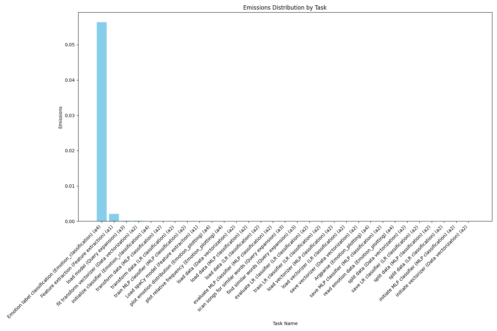

# CDS Language Analytics Assignment #5: Environmental Impact of Portfolio

## Description
This script aims to analyze estimated environmental impact of the other assignments in this repository. The other scripts have had their power usages tracked using CodeCarbon. The emissions are plotted using `matplotlib.pyplot`, using regular bar charts.

The main purpose of this assignment was to generate a plot which would show which assignment caused the most emissions, and another plot which would allow one to see which specific task of the portfolio generated the most emissions. In addition to this, i also decided to generate charts for each assignment, which would allow for a closer look at each assignment.

## Setup

1. Make sure to have python and Git Bash installed!

2. Open a Git Bash terminal and use Git to download the repository:
```sh
git  clone  https://github.com/missingusername/cds-lang-git.git
```
3. Navigate to the project folder for this assignment:
```sh
cd  cds-lang-git/assignment5
```
4. Before running the program, you first have to set up a virtual environment with the required dependencies. This can be done by simply running either  `bash win_setup.sh`  or  `bash unix_setup.sh`  depending on your system.

5. For this one, you don't need to download any additional data. The emission files have been pre-supplied from my own runs of these scripts.

6. To run the program, you can run the OS-appropriate run script:
Run basic unix script:
```sh
bash unix_run.sh
```
Or on Windows:
```sh
bash win_run.sh
```

## Takeaways from output
Before Looking at the results, i feel it important to mention that for the sake of consistency and efficiency, all of the emissions were tracked on a 64-core cloud computer from UCloud. The machine used had the following specifications:

| **Property**  | **Details**                           |
|---------------|---------------------------------------|
| **OS**        | Ubuntu noble 24.04 x86_64             |
| **Host**      | PowerEdge C6420                       |
| **CPU**       | Intel(R) Xeon(R) Gold 6130 (64)z      |
| **GPU**       | Matrox Electronics Systems Ltd.       |
| **Memory**    | 33.31 GiB                             |

With that said, we can look at the results.

**Assignment Emissions**

To find out what assignment caused the most emissions overall, we can look at the following bar chart:


Here we can see that there is one assignment which towers above all others, `assignment 4`. This is to be expected, as during testing it was the one that consistently took the longest to run (about 1~1.5 hours). This is followed by the `assignment 1`, which took the second longest to run, but was still much faster compared to `assignment 4`. These results make sense, since code that is more computationally expensive would take longer to run, meaning more power consumed, meaning higher emissions.

With such a big gap, one could reasonably expect `assignment 4` to also have the most emission-heavy task, which is what we will look next.

**Task Emissions**

To find out what specific task caused the most emissions of the portfolio, we can look at the following bar chart:



Yet again, we can see that `assignment 4` towers well above the rest, with `assignment 1` again coming in at a distant 2nd place. Here we can see that the task which caused the most emission by far was the `emotion label calssification`, which was where we went through ever line of dialogue in Game of Thrones and extracted the most likely emotion label. Again, this was the part of `assignment 4` that took the longest to run, with the rest of the assignment being relatively emission free as can be seen here:


Here, we can see that the emotion classification script caused way more emission than the plotting, and that the emotion label extraction itself was way more taxing than the initialization of the model used for the classification. Again, this makes sense since the feature extraction is the most computationally expensive part of the program, and the rest of the code just processes the data that results from it.

Overall, the resulting outputs from this and CodeCarbon in general yield an important insight into the computationally expensive and envionmental impacts of machine learning and its training. This can put into perspective the often times obfuscated nature of machine learning and AI, and the real physical impact it can have on the world. 

## Limitations & improvements

As mentioned, the importance of utilizing CodeCarbon to track your projected emissions is great, since it helps "realize" how great the impact of machine learning is. However, the emission results i have tracked are only from running the programs 1 time. When considering how many times i ran the scripts during their development, that is a lot of emissions that werent tracked, and therefore not counted in their actual environmental impact. Because of this, it might be better to use CodeCarbon from the get-go in future coding projects, and have the emission tracking accumulated over time, to also show the environmental impact of the development itself.
